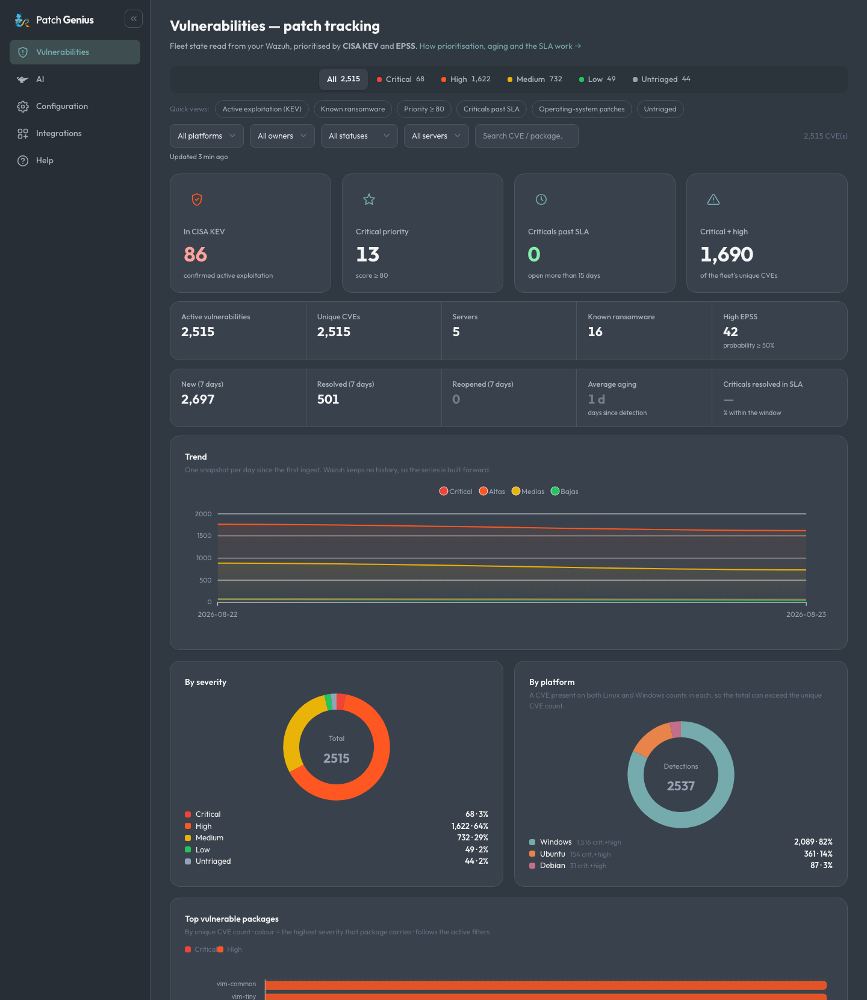
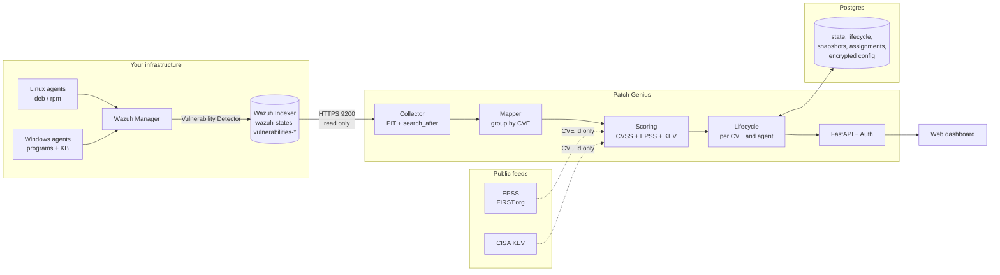
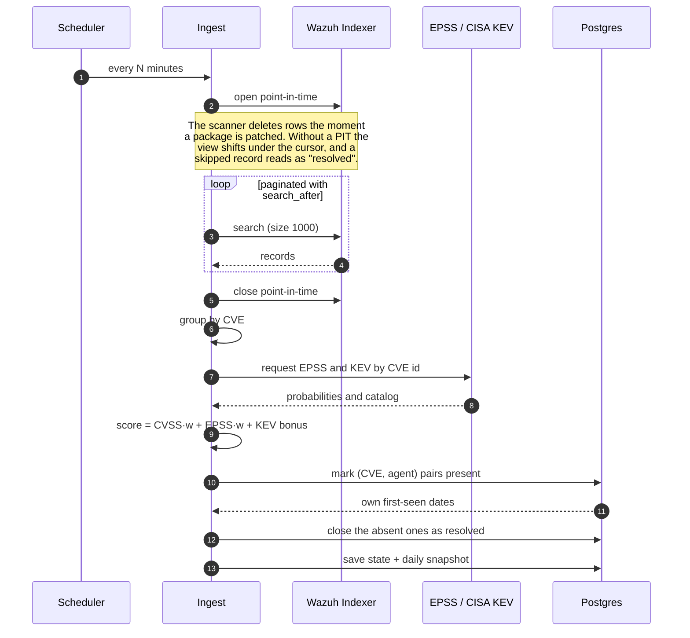
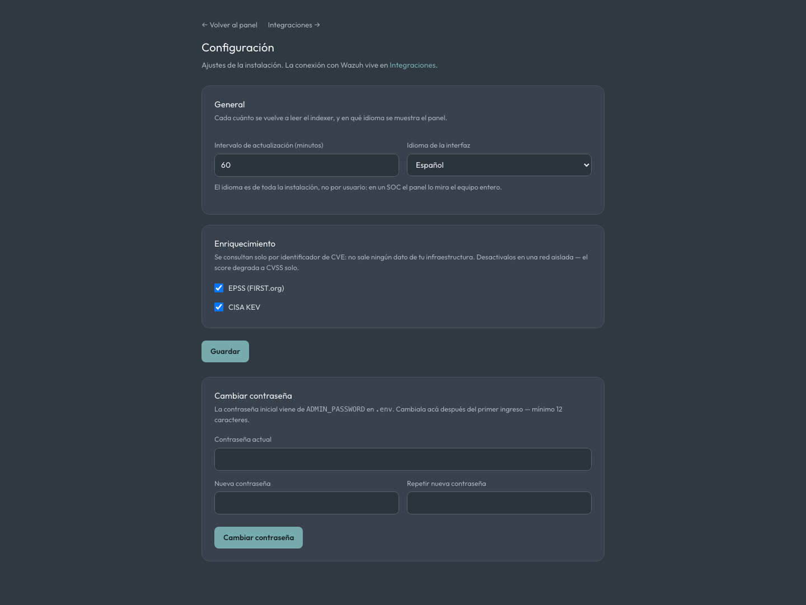
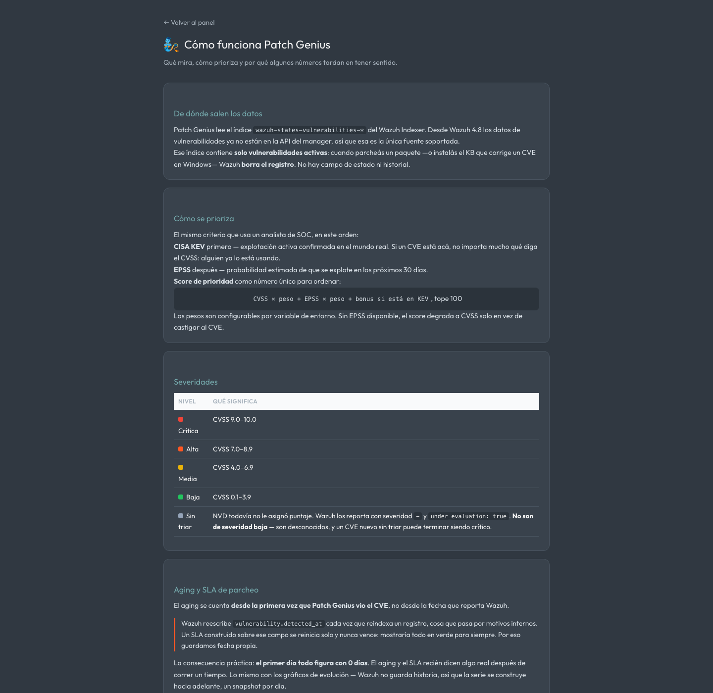

<div align="center">


# **Patch Genius**

**Vulnerability and patch tracking on top of your own Wazuh.**
Prioritises with CISA KEV and EPSS, measures real patching SLAs, and keeps Linux and Windows apart.

A product of **[Zebra Security](https://zebrasecurity.io)**.

[](LICENSE)


</div>

---

> **No sample data.** It shows what the Wazuh you configure reports, or nothing at all.



## What it solves

Wazuh tells you **what** is unpatched. It does not tell you what to patch **first**, how
long it has been that way, or who owns it.

| Problem | What Patch Genius does |
|---|---|
| Thousands of CVEs in no order | Ranks them: **KEV** first (confirmed exploitation), **EPSS** next, and a single score to sort by |
| Wazuh keeps no history | One snapshot per day; derives **new / resolved / reopened** by diffing successive ingests |
| `detected_at` resets itself | Keeps its **own** first-seen date, so the SLA clock does not restart and can actually breach |
| Windows buries the ranking | OS-level CVEs are listed separately — they close with a **cumulative update or KB**, not with `apt` |
| Nobody owns the patch | Owner, status and due date **per CVE and per agent** |

## Architecture



The public feeds are queried **by CVE identifier only** — nothing about your
infrastructure leaves the network. On an isolated host, turn them off and scoring degrades
to CVSS alone.

## How an ingest runs



## Install

Requirements: **Wazuh 4.8+**, network access to the Indexer (9200), Docker and Docker Compose.

```bash
git clone https://github.com/safernandez666/patch-genius.git
cd patch-genius
./scripts/setup-env.sh      # generates .env and prints your initial password
docker compose up -d --build
```

Open `http://localhost:8000` and connect your Wazuh from **Configuración**.

> If the Indexer only listens on `127.0.0.1` and this app runs on another host, read
> **[docs/ONBOARDING.md](docs/ONBOARDING.md)** first — that is where most deployments get
> stuck.

### Configuration



Test the connection before saving: it reports the cluster status and how many
vulnerability documents it can see. Credentials are stored **encrypted with Fernet** and
are never returned to the browser.

### Built-in help



## Security

- **Every route requires a login.** The dashboard lists the unpatched CVEs of live hosts;
  there is no open mode.
- Use a **read-only** Indexer user, not `admin` — see ONBOARDING.
- `APP_SECRET_KEY` encrypts the Wazuh credentials and never reaches the database or the
  repository.
- Change the initial password from the configuration tab after your first sign-in.

## Layout

```
app/          FastAPI: routes, ingest, scoring, auth and configuration
app/wazuh/    Indexer client and the mapping to the per-CVE view
static/       Frontend (vanilla HTML/CSS/JS + vendored ApexCharts)
docs/         Wazuh onboarding
deploy/       nginx and notes for deploying on your own VPS
```

> The interface itself is in Spanish. Documentation, code comments and commits are in
> English.

## License

MIT — see [LICENSE](LICENSE). Third-party assets keep their own:
see [static/assets/CREDITS.md](static/assets/CREDITS.md).

---

<div align="center">
<sub>Built by <a href="https://zebrasecurity.io"><b>Zebra Security</b></a></sub>
</div>
