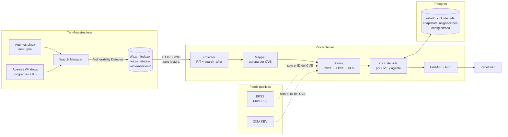
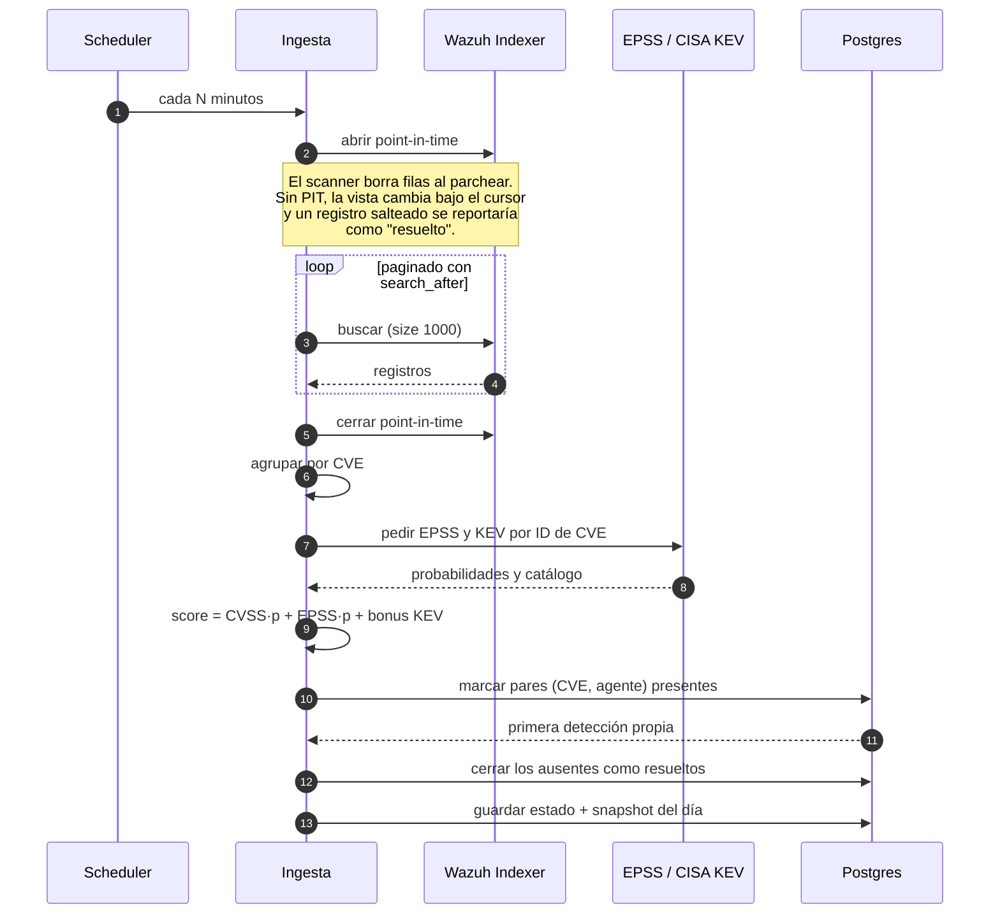

<div align="center">


# **Patch Genius**

**Seguimiento de vulnerabilidades y parcheo sobre tu propio Wazuh.**
Prioriza con CISA KEV y EPSS, calcula SLA y aging reales, y separa Linux de Windows.

[](LICENSE)


</div>

---

> **No trae datos de ejemplo.** Muestra lo que reporta el Wazuh que configures, o nada.
> Extraído de un panel SOC productivo y reescrito para que cualquiera lo apunte a su
> instalación.


## Qué resuelve

Wazuh te dice **qué** está sin parchear. No te dice qué parchear **primero**, ni hace
cuánto que viene sin parchear, ni quién es el responsable.

| Problema | Qué hace Patch Genius |
|---|---|
| Miles de CVEs sin orden | Prioriza: **KEV** primero (explotación confirmada), **EPSS** después, y un score único para ordenar |
| Wazuh no guarda historia | Un snapshot por día; deriva **nuevo / resuelto / reabierto** comparando ingestas |
| `detected_at` se resetea solo | Guarda **fecha propia** de primera detección, así el SLA no se reinicia y sí vence |
| Windows tapa el ranking | Los CVEs a nivel SO van aparte: se cierran con un **KB acumulativo**, no con `apt` |
| Nadie es dueño del parche | Responsable, estado y fecha objetivo **por CVE y por agente** |

## Arquitectura



A los feeds públicos se les consulta **únicamente por identificador de CVE**: no sale
ningún dato de tu infraestructura. En una red aislada se desactivan y el score degrada a
CVSS solo.

## Cómo funciona una ingesta



## Instalación

Requisitos: **Wazuh 4.8+**, acceso al Indexer (9200), Docker y Docker Compose.

```bash
git clone https://github.com/safernandez666/patch-tracker.git
cd patch-tracker
./scripts/setup-env.sh      # genera .env e imprime tu contraseña inicial
docker compose up -d --build
```

Entrá a `http://localhost:8000` y conectá tu Wazuh desde **Configuración**.

> Si el Indexer solo escucha en `127.0.0.1` y esta app corre en otro host, leé
> **[docs/ONBOARDING.md](docs/ONBOARDING.md)** primero — es donde se traba la mayoría.

### Configuración


Probá la conexión antes de guardar: te devuelve el estado del cluster y cuántos documentos
de vulnerabilidades ve. Las credenciales se guardan **cifradas con Fernet** y nunca vuelven
al navegador.

### Ayuda integrada


## Seguridad

- **Todas las rutas requieren login.** La pantalla lista los CVEs sin parchear de máquinas
  vivas; no hay modo abierto.
- Usá un usuario de **solo lectura** del Indexer, no `admin` — ver ONBOARDING.
- `APP_SECRET_KEY` cifra las credenciales de Wazuh y nunca va a la base ni al repositorio.
- Cambiá la contraseña inicial desde Configuración después del primer ingreso.

## Estructura

```
app/          FastAPI: rutas, ingesta, scoring, auth y configuración
app/wazuh/    Cliente del Indexer y mapeo a la vista por CVE
static/       Frontend (HTML/CSS/JS vanilla + ApexCharts vendorizado)
docs/         Onboarding de Wazuh
deploy/       nginx + notas para desplegar en un VPS propio
```

## Licencia

MIT — ver [LICENSE](LICENSE). Los assets de terceros conservan la suya:
ver [static/assets/CREDITS.md](static/assets/CREDITS.md).
