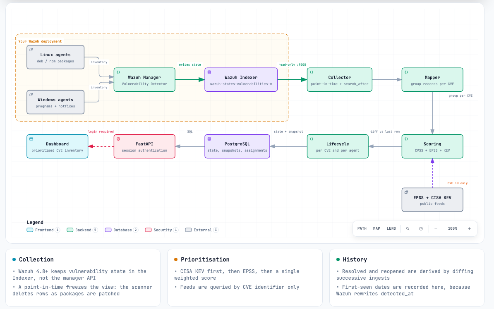
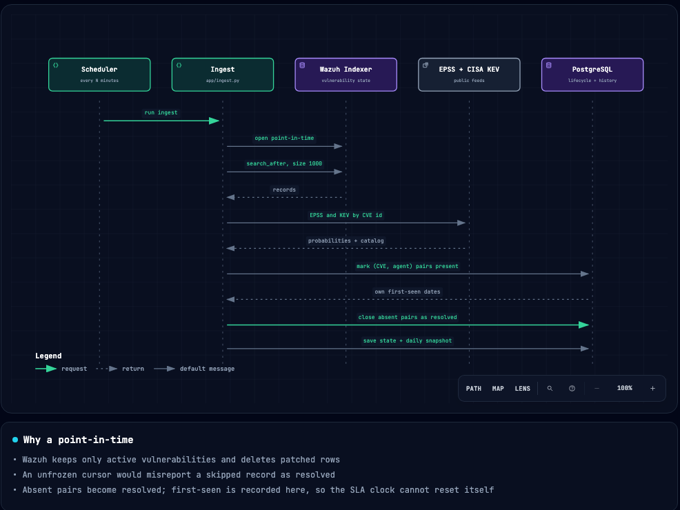
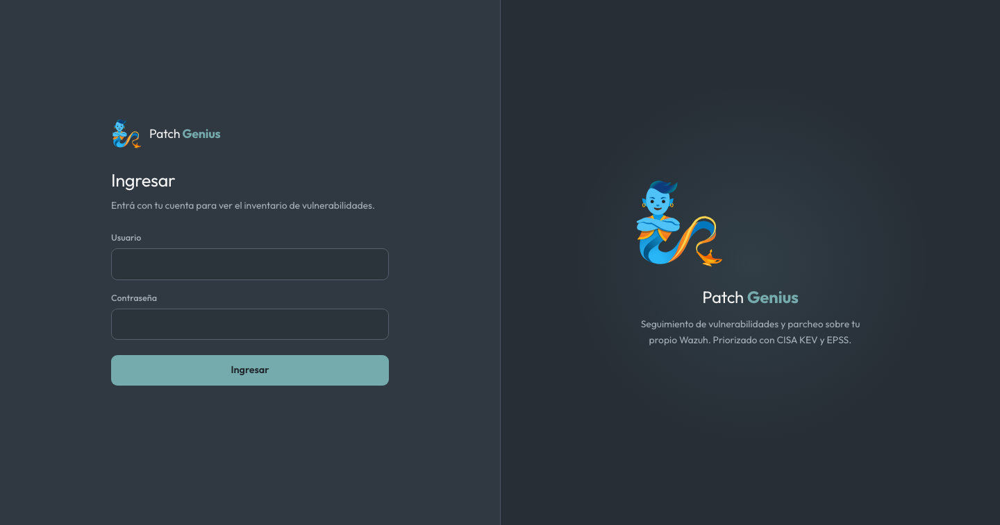
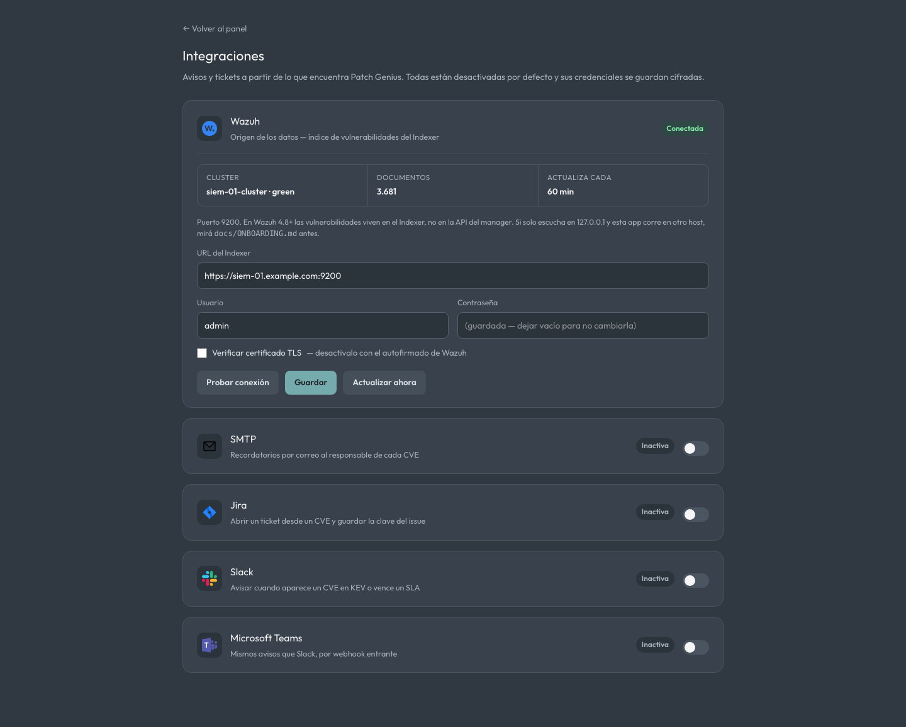
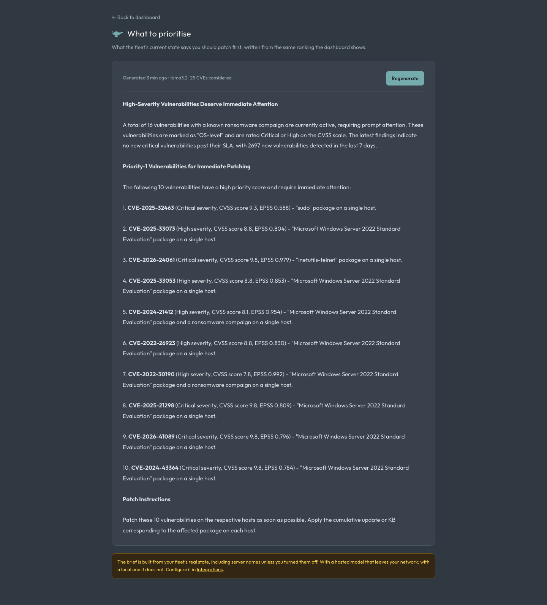

<div align="center">


# Patch Genius

**Vulnerability and patch tracking on top of your own Wazuh.**

[](LICENSE)
[](https://wazuh.com)


[](https://zebrasecurity.io)

[Overview](#overview) • [Features](#features) • [How it works](#how-it-works) • [Get started](#get-started) • [Security](#security) • [FAQ](#faq)


</div>

Wazuh tells you **what** is unpatched. It does not tell you what to patch **first**, how
long it has been that way, or who owns it. Patch Genius reads the vulnerability state out
of your Wazuh Indexer, ranks it the way an analyst would, and tracks remediation per CVE
and per agent.

> [!IMPORTANT]
> There is no sample data and no demo mode. The dashboard shows what the Wazuh you
> configure reports, or nothing at all.

## Overview

Wazuh 4.8 moved vulnerability data out of the manager API and into the indexer, so
`wazuh-states-vulnerabilities-*` is the only supported source. That index holds
**currently active vulnerabilities only** — a record is deleted the moment a package is
patched, and there is no status field and no history.

Everything the dashboard shows about time is therefore derived here, not read from Wazuh:

- **Resolved and reopened** come from diffing each ingest against the previous one.
- **Aging and SLA** run on a first-seen date this app records itself. Wazuh rewrites
  `vulnerability.detected_at` whenever it re-indexes a record, so a clock built on that
  field silently restarts and never breaches.

## Features

- **Ranked the way an analyst would** — CISA KEV first (confirmed exploitation in the
  wild), EPSS next (probability of exploitation within 30 days), then a single weighted
  score to sort by: `CVSS·w + EPSS·w + KEV bonus`.
- **Linux and Windows kept apart** — an OS-level finding closes with a cumulative update
  or KB, not with `apt`. A single Windows build can carry thousands of CVEs, so those are
  summarised separately instead of flattening every real package out of the ranking.
- **Untriaged CVEs kept visible** — Wazuh reports unscored CVEs with severity `-` and the
  sentinel score `-1.0`. They get their own bucket rather than being dropped or ranked as
  a genuine zero: unscored means unknown, not harmless.
- **Ownership per CVE and per agent** — the same CVE can be resolved on one host and open
  on another, so owner, status and due date are tracked at that granularity.
- **A brief that says what to do** — an LLM turns the ranking into a paragraph naming the
  packages to patch first, written on demand. Claude, OpenAI, or a local model: hostnames
  are included by default because that is what makes it actionable, and a single switch
  strips them. Anyone who cannot send that inventory out points it at their own endpoint
  and nothing leaves.
- **Onboarding in the app** — the Wazuh connection is configured from a tab, tested before
  it is saved, and stored encrypted. Nothing is baked into the image.
- **English or Spanish** — set once for the installation, since a SOC screen is read by the
  whole team.
- **No build step** — clone, `docker compose up`. No Node, no CDN, no external asset
  fetches, which matters on isolated networks.

## How it works

[](docs/diagrams/architecture.html)

<sub>Open [`docs/diagrams/architecture.html`](docs/diagrams/architecture.html) for the
interactive version — guided views, relationship tracing, light/dark and export.</sub>

> [!NOTE]
> The public feeds are queried **by CVE identifier only** — nothing about your
> infrastructure leaves the network. The KEV catalog is cached in Postgres for six hours,
> so a normal ingest does not call CISA at all, and a fetch that fails falls back to the
> last catalog it held. On an air-gapped host, turn the feeds off and scoring degrades to
> CVSS alone.

A single ingest:

[](docs/diagrams/ingest.html)

<sub>Interactive: [`docs/diagrams/ingest.html`](docs/diagrams/ingest.html)</sub>

## Get started

You need **Wazuh 4.8 or newer**, network access to its Indexer on port 9200, and Docker
with Docker Compose.

```bash
git clone https://github.com/safernandez666/patch-genius.git
cd patch-genius
./scripts/setup-env.sh
docker compose up -d --build
```

`setup-env.sh` generates `.env` with a fresh encryption key and a random admin password,
and prints the credentials. Skip it and the sign-up screen creates the first account
instead — it answers only while no account exists and closes itself the moment one does, so
it never becomes an open registration form.



### Integrations

Wazuh, SMTP, Jira, Slack and Microsoft Teams are configured from one page.



**Test** exercises the real thing — it authenticates against the indexer, sends the mail,
posts to the channel — because a saved setting that was never tried tells you nothing.
Credentials are encrypted at rest and never returned to the browser; a webhook URL counts
as one, since anyone holding it can post into your channel.

### What to prioritise

The ranking answers "which CVE is worst". This answers "what do I do on Monday" — written
on demand, from the dashboard or from this page.



> [!WARNING]
> The brief is built from the fleet's real state, hostnames included — that is what makes
> it specific enough to act on. With a hosted model that inventory leaves your network.
> Turn off **Include server hostnames** and the model sees host counts instead of names, or
> point it at a local OpenAI-compatible endpoint and nothing leaves at all. It ships
> disabled.

### Configuration

Everything about this installation rather than a connection: how often the indexer is
re-read, which language the interface uses, whether the public feeds are enabled, and the
password.


> [!WARNING]
> A default Wazuh install binds the Indexer to `127.0.0.1` only. If Patch Genius runs on a
> different host you must either expose port 9200 or tunnel to it — and exposing it
> switches OpenSearch into production mode, where failed bootstrap checks stop the service
> from starting. [docs/ONBOARDING.md](docs/ONBOARDING.md) covers the preconditions to
> verify first, and how to roll back.

The app explains its own scoring, lifecycle and SLA rules at `/ayuda`:


## Security

This dashboard is an inventory of what is unpatched on live machines, and the
configuration holds Wazuh credentials. Both are treated accordingly.

- **Every route requires a login.** There is no anonymous view.
- **Credentials are encrypted at rest** with Fernet, using `APP_SECRET_KEY`, which never
  reaches the database or the repository. They are never returned to the browser.
- **Use a read-only Indexer account**, not `admin`. ONBOARDING walks through creating one
  scoped to `wazuh-states-*` with `cluster_composite_ops_ro`.
- **Configuration is admin-only.** Integrations, the password, the app settings and the
  manual ingest all require the `admin` role, not merely a session.
- **Sign-in is rate limited** — 10 attempts a minute per IP, 5 for the first-run sign-up.
- **The container runs as an unprivileged user** and declares a healthcheck; runtime
  dependencies are pinned in `requirements-lock.txt`, which is what the image installs.
- **Change the bootstrap password** from the configuration tab after signing in.

## FAQ

**Why are the trend charts empty on day one?**
Wazuh keeps no history, so the series is built forward from your first ingest — one
snapshot per day. Aging is 0 for everything until the app has been running a while.

**Why does the platform breakdown add up to more than the CVE count?**
A CVE present on both a Debian box and a Windows one is genuinely open in two places, so
it is counted under both.

**Can it read from something other than Wazuh?**
Not yet, but the collector is the only Wazuh-specific part. `app/ingest.py:collect()`
dispatches on the configured scanner, and everything downstream consumes a normalised
record shape, so adding another source means writing one collector.

**Does anything of mine reach the model?**
Only if you enable the brief and choose a hosted provider. It sends the fleet snapshot —
severity counts, platform split, patching metrics, and the top 25 CVEs with their hosts and
packages. Turning off **Include server hostnames** replaces the names with a count; a local
endpoint keeps all of it inside your network. EPSS and CISA KEV are separate and only ever
see CVE identifiers.

**Where do I change the scoring weights?**
Environment variables — `VULN_CVSS_WEIGHT`, `VULN_EPSS_WEIGHT`, `VULN_KEV_WEIGHT`,
`VULN_SLA_CRITICAL_DAYS` and friends. See `app/settings.py`.

---

<div align="center">
<sub>Built by <a href="https://zebrasecurity.io"><b>Zebra Security</b></a></sub>
</div>
